# SNOMED CT Modules
SNOMED is distributed in multiple "modules".  Each module makes a set of assertions about a collection of SNOMED CT concepts.  SNOMED CT International is composed of two modules:

* International Release, Core Module (900000000000207008)
* SNOMED CT Model Component Module (900000000000012004) (aka. "Metadata module")

While the SNOMED CT core module is dependent on parts of the SNOMED CT Model Component Module, normally only a small subset of the metadata module concepts are included in the OWL representation of the core module.

The SNOMED CT US Edition (731000124108) includes both the International Core module and the Model Component module.  It does, however, add some concepts, de-activate some descriptions, add some new ones, etc.

## International Release Core and Model Component imports
The general notion is that the International Release, Core Module could use an ```owl:import``` to include the Model Component module if so desired -- the approach would be to generate both the SNOMED International Core module (using US English) and the SNOMED International Model Component module (using US and GB English...)

```bash
> SNOMEDToOWL -o sct_core_us.ttl ~/data/terminology/SNOMEDCT/SnomedCT_RF2Release_INT_20160731/Snapshot sct_core_us.json
> SNOMEDToOWL -o sct_metadata_us_gb.ttl ~/data/terminology/SNOMEDCT/SnomedCT_RF2Release_INT_20160731/Snapshot sct_metadata_us_gb.json
```

We could then load ```sct_core_us.ttl``` into Protege and note that the SNOMED CT Model Component (metadata) section has limited content -- only the concepts declared as members of the core module + their ancestors:

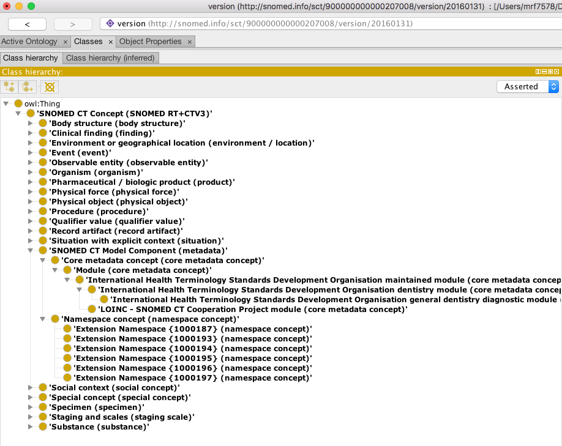

We can then import the Model Component Module:

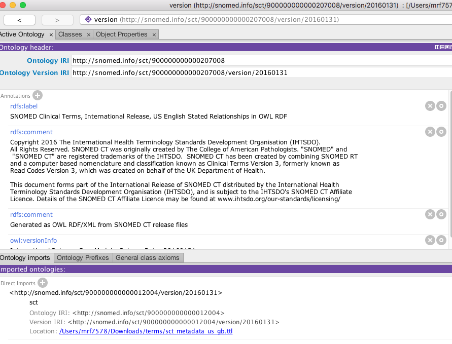

which completely fills out the metadata section:

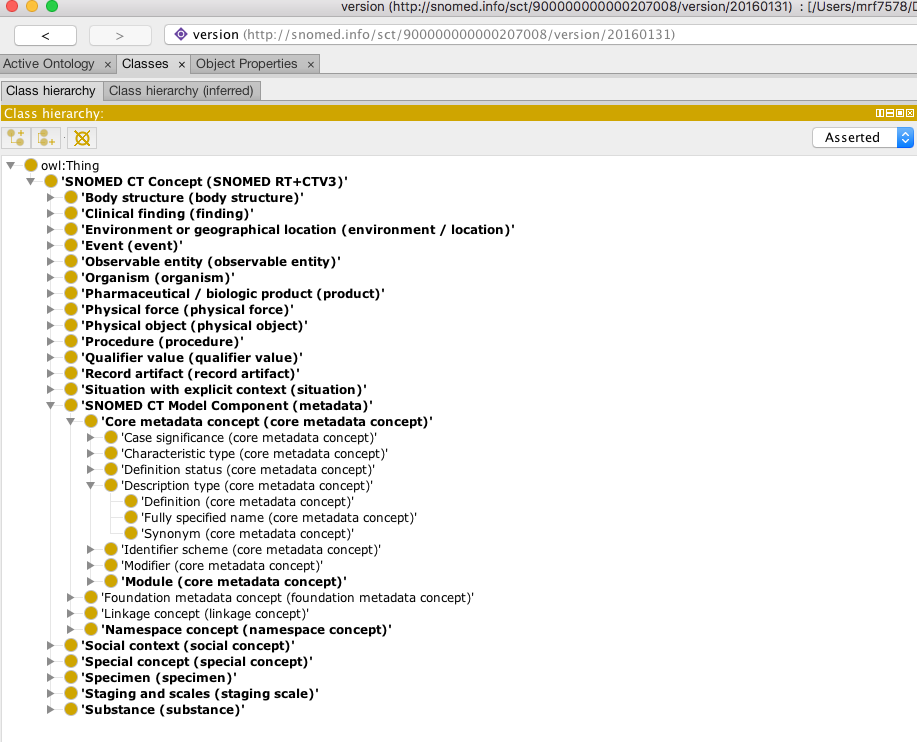

Note that the SNOMED CT concept ```410662002 | Concept model attribute |``` and its descendants are represented as OWL ObjectProperties.  Concept model attribute and its descendants are included in *every* module representation.  All other descendants of ```106237007 | Linkage concept |``` are currently represented as OWL Classes and only in the Model Component module.

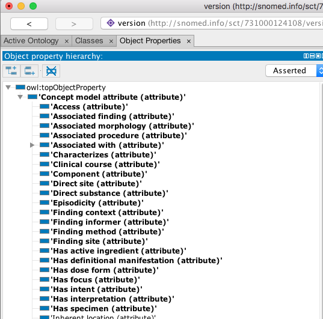


## US Edition and International Edition imports

We could generate the inferred US Edition (using US english) and the inferred SNOMED CT Core:

```bash
>  SNOMEDToOWL -o us_edition_us_inferred.ttl  ~/data/terminology/SNOMEDCT/SnomedCT_RF2Release_US1000124_20160301/Snapshot/ us_edition_us_inferred.json
>  SNOMEDToOWL -o sct_core_us_inferred.ttl ~/data/terminology/SNOMEDCT/SnomedCT_RF2Release_INT_20160731/Snapshot sct_core_us_inferred.json
```
When the US edition is loaded by itself, we only get what has been defined or changed plus all of the core concept references:


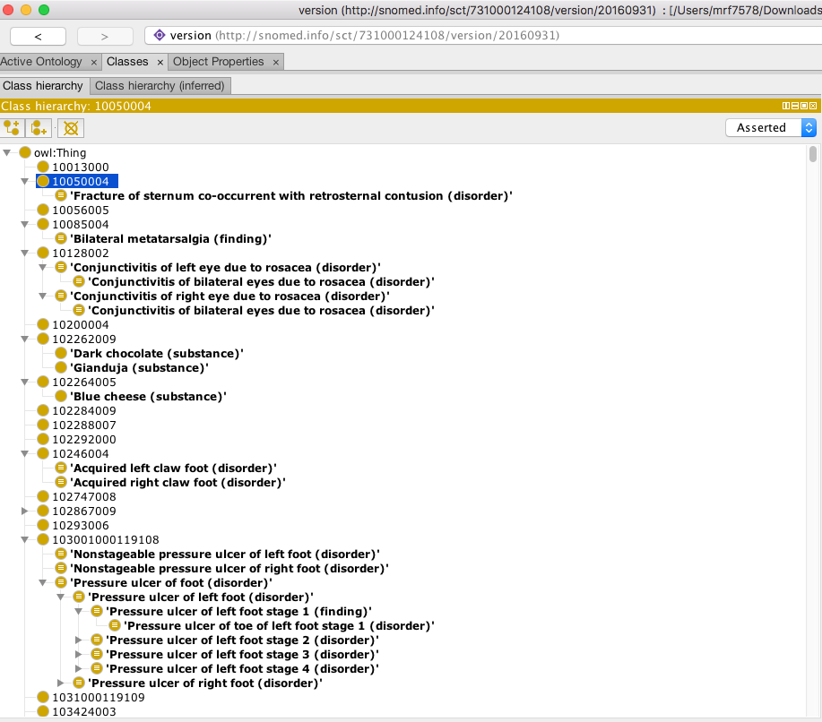

If we then import the SNOMED International Core:

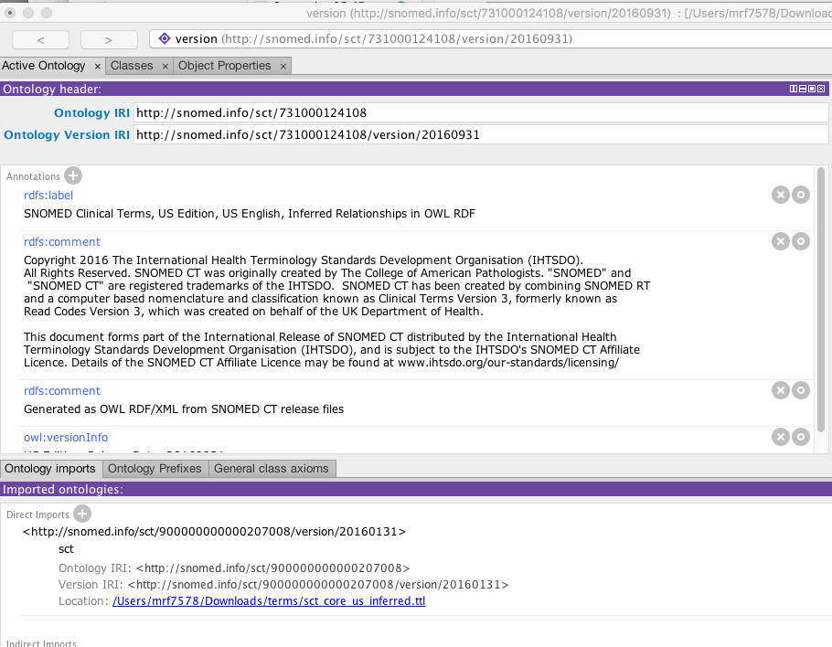

Where we then find the additions properly positioned:

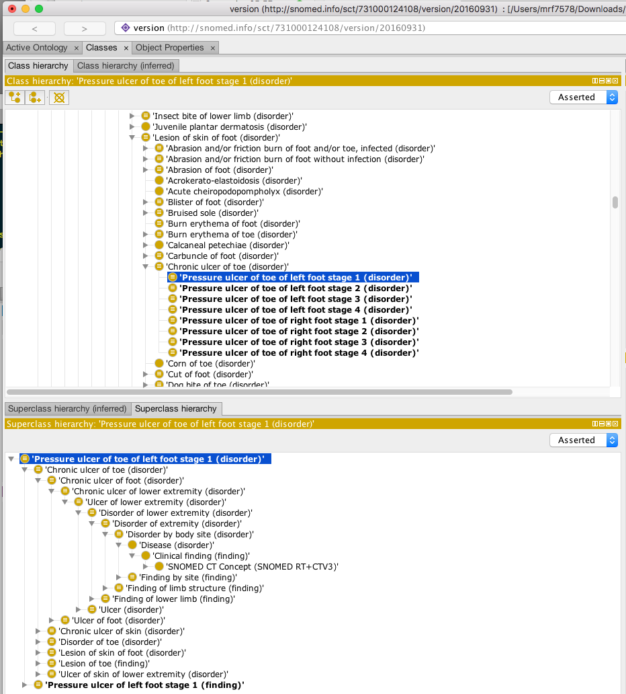

It is interesting to note that there are a number of concepts that aren't recognized:

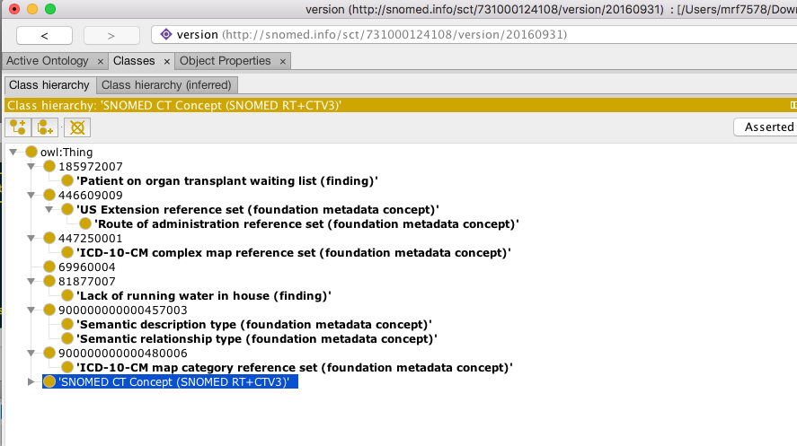

Some of these are references to SCT International Metadata -- the US edition is partly dependent on it.  We can import the core metadata:

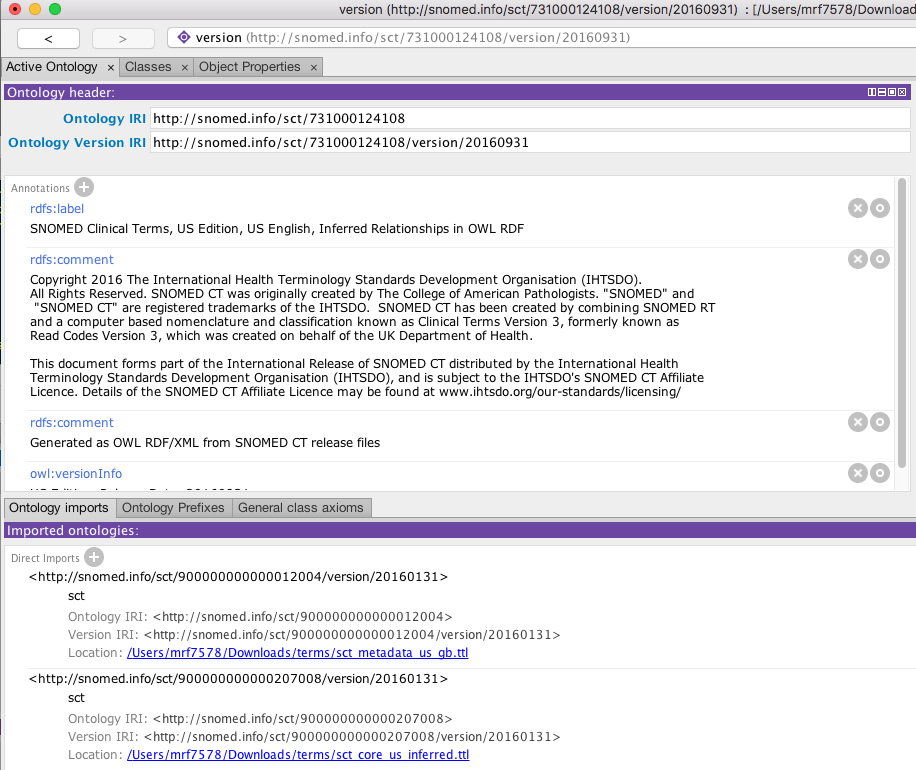

Which resolves some of the references:  

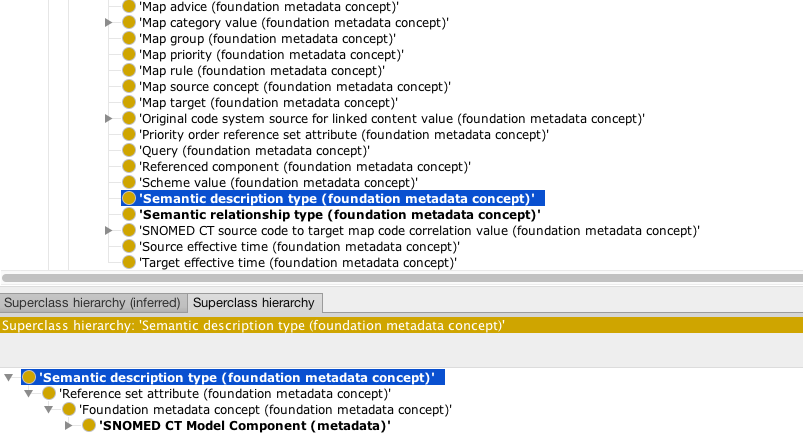

The remainder, however, turn out to be retired concepts, which simply do not appear in the OWL representation.  ```69960004 | Antineoplastic chemotherapy regimen (procedure) |```, ```185972007 | Patient on waiting list for op (finding) |```, and ```81877007 | Housing problems (finding) |``` are all retired.
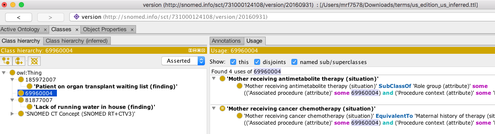


It turns out that there are a couple of issues with this approach:

1. The US Edition is not "monotonic" -- it actually changes parts of the International release.  As an example, it deactivates the FSN for concept ```407309009 | Escherichia coli, serotype Orough (organism) |``` and substitutes ```Escherichia coli serogroup Orough (organism)``` in its place.  The import described above doesn't show this, as, by *importing* the International Release, we end up with two names.  One possible solution to this would be to generate both the International and US Edition from the US RF2 release files.  One would want to create a different ontology URI for the result, however, as the US "view" of SNOMED CT International is not the same as the international view.
2. The US edition sometimes changes descriptions for concepts.  It changes the module identifier for the description itself, but it doesn't change the corresponding records in the Language refset.  As an example the description entry below:

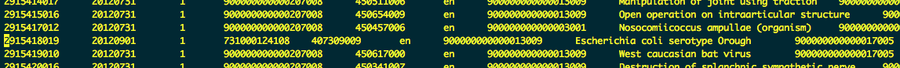

Has this entry in the language refset:

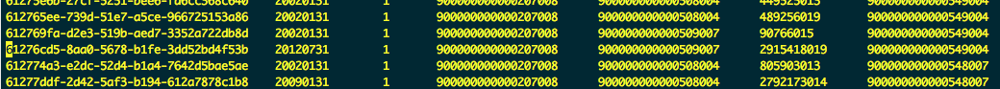
