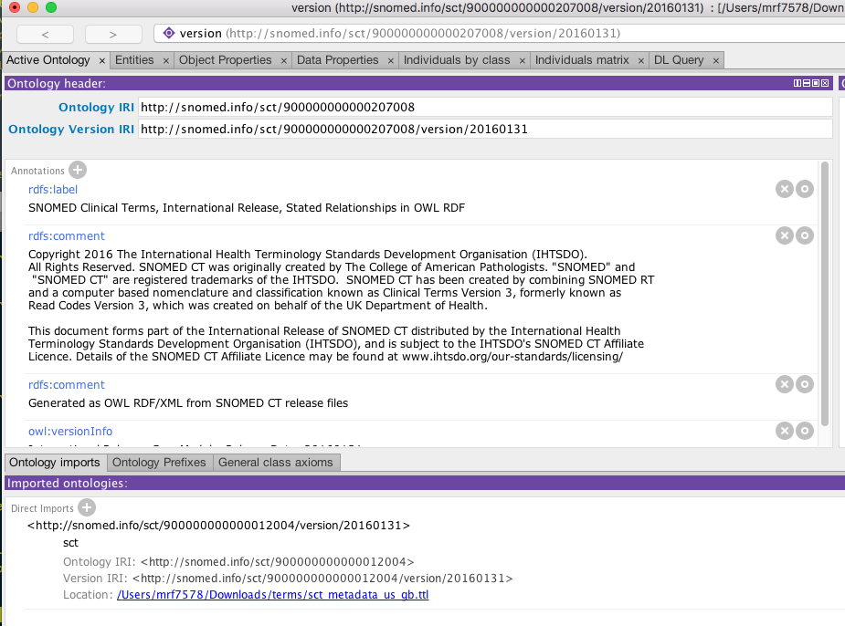

# SNOMED CT Modules
SNOMED is distributed in multiple "modules".  Each module makes a set of assertions about a collection of SNOMED CT concepts.  SNOMED CT International is composed of two modules:

* International Release, Core Module (900000000000207008)
* SNOMED CT Model Component Module (900000000000012004) (aka. "Metadata module)

While the SNOMED CT core module is dependent on parts of the SNOMED CT Model Component Module, normally only a small subset of the metadata module concepts are included in the OWL representation of the core module.

The SNOMED CT US Edition (731000124108) includes both the International Core module and the Model Component module.  It does, however, add some concepts, de-activate some descriptions, add some new ones, etc.

The general notion is that the International Release, Core Module could use an ```owl:import``` to include the Model Component module if so desired -- the approach would be:

```bash
> SNOMEDToOWL -o sct_core_us_inferred.ttl ~/data/terminology/SNOMEDCT/SnomedCT_RF2Release_INT_20160731/Snapshot ~/Development/venv/test/lib/python3.5/site-packages/SNOMEDCTToOWL/conf/sct_core_us_inferred.json
> SNOMEDToOWL -o sct_metadata_us_gb.ttl ~/data/terminology/SNOMEDCT/SnomedCT_RF2Release_INT_20160731/Snapshot ~/Development/venv/test/lib/python3.5/site-packages/SNOMEDCTToOWL/conf/sct_metadata_us_gb.json
```

We could then load ```scrt_core_us_inferred.ttl``` into Protege and then import the metadata module:


In a similar fashion, we could generate the US Edition:

```bash
>  SNOMEDToOWL -o us_edition_us_inferred.ttl  ~/data/terminology/SNOMEDCT/SnomedCT_RF2Release_US1000124_20160301/Snapshot/ ~/Development/venv/test/lib/python3.5/site-packages/SNOMEDCTToOWL/conf/us_edition_us_inferred.json
```

And then load it into Protege and subsequently import the international edition:


It turns out that there are a couple of issues with this approach:

1. The US Edition is not "monotonic" -- it actually changes parts of the International release.  As an example, it deactivates the FSN for concept ```407309009 | Escherichia coli, serotype Orough (organism) |``` and substitutes ```Escherichia coli serogroup Orough (organism)``` in its place.  The import described above doesn't show this, as, by *importing* the International Release, we end up with two names.  One possible solution to this would be to generate both the International and US Edition from the US RF2 release files.  One would want to create a different ontology URI for the result, however, as the US "view" of SNOMED CT International is not the same as the international view.
2. While the US edition adds Language file entries for the new FSN's and additional synonyms, it records them using the International Core Module module id.  This leaves us in a bit of a quandary, as, from the perspective of the International Core Module, there are a bunch of language entries for descriptions that don't exist, but from the perspective of the US Edition, none of the descriptions are considered acceptable. 

Both of these issues need to be addressed at a higher level, but, for the time being we propose the following solution:

1. Create a new configuration module 